# Backend Reference — StudentApp

## Entities & Relationships
> ERD-style summary, one line per relationship

[StudentProfile] 1──N [Enrollment]
[Enrollment] N──M [Course]
[Program] 1──N [Course]
[Course] 1──N [Section]
[StudentProfile] 1──N [EvaluationSubmission]
[StudentProfile] 1──N [DocumentRequest]
[StudentProfile] 1──N [Complaint]
[StudentProfile] 1──N [GradeRecord]
[StudentProfile] 1──N [Transaction]
[StudentProfile] N──M [LibraryBook]
[StudentProfile] 1──N [ScheduleEntry]

---

## StudentProfile

### Model
| Field | Type | Notes |
|-------------|-----------|--------------------|
| id | string | UUID, PK (from `accountId`) |
| fullName | string | |
| emailAddress | string | |
| phoneNumber | string | |
| accountLabel | string | |
| programSummary | string | |
| twoFactorStatus | string | `Disabled` \| `PendingVerification` \| `Enabled` |
| emergencyContactName | string | |
| emergencyContactRelationship | string | |
| emergencyContactPhoneNumber | string | |
| emailNotifications | boolean | |
| smsNotifications | boolean | |
| systemAlerts | boolean | |
| createdAt | Date | server-set |
| updatedAt | Date | server-set |

### Mermaid JS
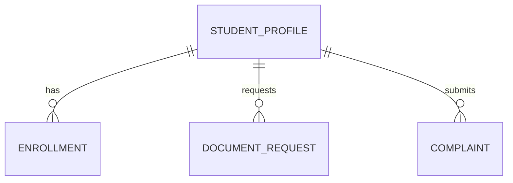

### Routes
| Method | Path | DTO In | DTO Out |
|--------|-----------------------|---------------|-------------------|
| GET | /students/:id | — | StudentProfileResponseDTO |
| PUT | /students/:id | UpdateStudentProfileDTO | StudentProfileResponseDTO |

### DTOs

**CreateStudentProfileDTO**
```ts
const CreateStudentProfileDTO = z.object({
  fullName: z.string(),
  emailAddress: z.string().email(),
  phoneNumber: z.string(),
  accountLabel: z.string(),
  programSummary: z.string(),
  twoFactorStatus: z.enum(["Disabled", "PendingVerification", "Enabled"]),
  emergencyContactName: z.string(),
  emergencyContactRelationship: z.string(),
  emergencyContactPhoneNumber: z.string(),
  emailNotifications: z.boolean(),
  smsNotifications: z.boolean(),
  systemAlerts: z.boolean(),
})

const UpdateStudentProfileDTO = CreateStudentProfileDTO.partial()

const StudentProfileResponseDTO = z.object({
  id: z.string().uuid(),
  fullName: z.string(),
  emailAddress: z.string().email(),
  phoneNumber: z.string(),
  accountLabel: z.string(),
  programSummary: z.string(),
  twoFactorStatus: z.enum(["Disabled", "PendingVerification", "Enabled"]),
  emergencyContactName: z.string(),
  emergencyContactRelationship: z.string(),
  emergencyContactPhoneNumber: z.string(),
  emailNotifications: z.boolean(),
  smsNotifications: z.boolean(),
  systemAlerts: z.boolean(),
  createdAt: z.string().datetime(),
  updatedAt: z.string().datetime(),
})
```

## Program

### Model
| Field | Type | Notes |
|-------------|-----------|--------------------|
| id | string | UUID, PK (inferred) |
| title | string | |
| badgeText | string | |
| badgeVariant | string | `Accent` \| `Primary` |
| scheduleLine | string | |
| description | string | |
| category | string | `Undergraduate` \| `Postgraduate` |
| createdAt | Date | server-set |

### Mermaid JS
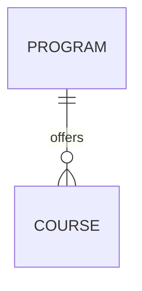

### Routes
| Method | Path | DTO In | DTO Out |
|--------|-----------------------|---------------|-------------------|
| GET | /programs | — | ProgramResponseDTO[] |
| GET | /programs/:id | — | ProgramResponseDTO |

### DTOs

**CreateProgramDTO**
```ts
const CreateProgramDTO = z.object({
  title: z.string(),
  badgeText: z.string(),
  badgeVariant: z.enum(["Accent", "Primary"]),
  scheduleLine: z.string(),
  description: z.string(),
  category: z.enum(["Undergraduate", "Postgraduate"]),
})

const UpdateProgramDTO = CreateProgramDTO.partial()

const ProgramResponseDTO = z.object({
  id: z.string().uuid(),
  title: z.string(),
  badgeText: z.string(),
  badgeVariant: z.enum(["Accent", "Primary"]),
  scheduleLine: z.string(),
  description: z.string(),
  category: z.enum(["Undergraduate", "Postgraduate"]),
  createdAt: z.string().datetime(),
})
```

## Course

### Model
| Field | Type | Notes |
|-------------|-----------|--------------------|
| id | string | UUID, PK (inferred) |
| code | string | unique |
| title | string | |
| semesterTitle | string? | nullable |
| instructor | string? | nullable |
| units | number? | nullable |
| schedule | string? | nullable |
| location | string? | nullable |
| grade | string? | nullable |
| waitlistStatus | string? | nullable |
| progress | number? | 0..1 |
| status | string? | `Enrolled` \| `Completed` \| `Waitlisted` |
| tuition | number? | nullable |
| isLocked | boolean? | nullable |
| lockReason | string? | nullable |
| programId | string? | FK `Program.id` |
| createdAt | Date | server-set |

### Mermaid JS
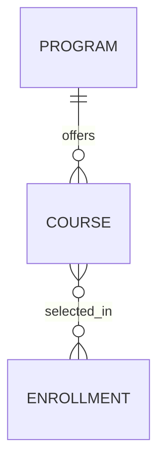

### Routes
| Method | Path | DTO In | DTO Out |
|--------|-----------------------|---------------|-------------------|
| GET | /courses | — | CourseResponseDTO[] |

### DTOs

**CreateCourseDTO**
```ts
const CreateCourseDTO = z.object({
  code: z.string(),
  title: z.string(),
  semesterTitle: z.string().optional(),
  instructor: z.string().optional(),
  units: z.number().int().optional(),
  schedule: z.string().optional(),
  location: z.string().optional(),
  grade: z.string().optional(),
  waitlistStatus: z.string().optional(),
  progress: z.number().min(0).max(1).optional(),
  status: z.enum(["Enrolled", "Completed", "Waitlisted"]).optional(),
  tuition: z.number().optional(),
  isLocked: z.boolean().optional(),
  lockReason: z.string().optional(),
  programId: z.string().uuid().optional(),
})

const UpdateCourseDTO = CreateCourseDTO.partial()

const CourseResponseDTO = z.object({
  id: z.string().uuid(),
  code: z.string(),
  title: z.string(),
  semesterTitle: z.string().optional(),
  instructor: z.string().optional(),
  units: z.number().int().optional(),
  schedule: z.string().optional(),
  location: z.string().optional(),
  grade: z.string().optional(),
  waitlistStatus: z.string().optional(),
  progress: z.number().optional(),
  status: z.enum(["Enrolled", "Completed", "Waitlisted"]).optional(),
  tuition: z.number().optional(),
  isLocked: z.boolean().optional(),
  lockReason: z.string().optional(),
  programId: z.string().uuid().optional(),
  createdAt: z.string().datetime(),
})
```

## Enrollment

### Model
| Field | Type | Notes |
|-------------|-----------|--------------------|
| id | string | UUID, PK |
| studentId | string | FK `StudentProfile.id` |
| courseIds | string[] | FK array `Course.id` |
| fullName | string | submitted in Personal Info step |
| studentIdNumber | string | UI label: Student ID Number |
| emailAddress | string | |
| phoneNumber | string | |
| emergencyContactName | string | |
| relationship | string | |
| emergencyPhone | string | |
| selectedCredits | number | computed/server-validated |
| estimatedTuition | number | computed/server-validated |
| status | string | `Draft` \| `Confirmed` \| `Adjusted` |
| createdAt | Date | server-set |
| updatedAt | Date | server-set |

### Mermaid JS
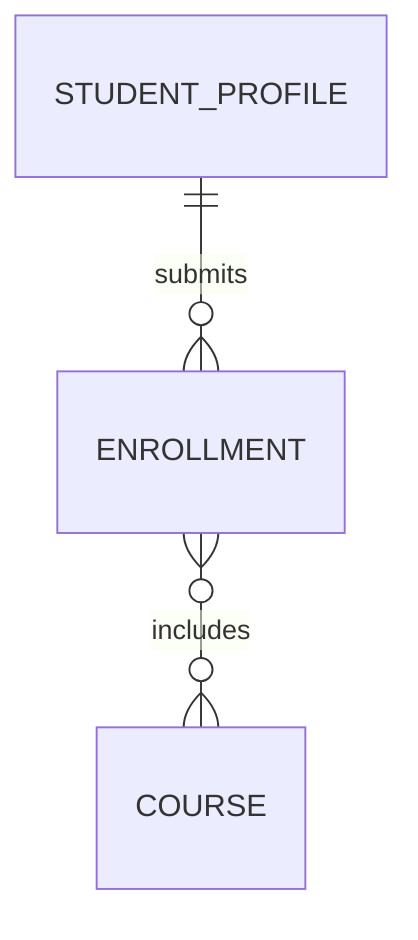

### Routes
| Method | Path | DTO In | DTO Out |
|--------|-----------------------|---------------|-------------------|
| GET | /enrollments | — | EnrollmentResponseDTO[] |
| GET | /enrollments/:id | — | EnrollmentResponseDTO |
| POST | /enrollments | CreateEnrollmentDTO | EnrollmentResponseDTO |
| PUT | /enrollments/:id | UpdateEnrollmentDTO | EnrollmentResponseDTO |
| DELETE | /enrollments/:id | — | { success: bool } |

### DTOs

**CreateEnrollmentDTO**
```ts
const CreateEnrollmentDTO = z.object({
  studentId: z.string().uuid(),
  courseIds: z.array(z.string().uuid()).min(1),
  fullName: z.string(),
  studentIdNumber: z.string(),
  emailAddress: z.string().email(),
  phoneNumber: z.string(),
  emergencyContactName: z.string(),
  relationship: z.string(),
  emergencyPhone: z.string(),
})

const UpdateEnrollmentDTO = CreateEnrollmentDTO.partial()

const EnrollmentResponseDTO = z.object({
  id: z.string().uuid(),
  studentId: z.string().uuid(),
  courseIds: z.array(z.string().uuid()),
  fullName: z.string(),
  studentIdNumber: z.string(),
  emailAddress: z.string().email(),
  phoneNumber: z.string(),
  emergencyContactName: z.string(),
  relationship: z.string(),
  emergencyPhone: z.string(),
  selectedCredits: z.number().int(),
  estimatedTuition: z.number(),
  status: z.enum(["Draft", "Confirmed", "Adjusted"]),
  createdAt: z.string().datetime(),
  updatedAt: z.string().datetime(),
})
```

## EvaluationSubmission

### Model
| Field | Type | Notes |
|-------------|-----------|--------------------|
| id | string | UUID, PK (inferred) |
| studentId | string | FK `StudentProfile.id` |
| courseCodeTitle | string | from pending course card |
| instructor | string | |
| teachingQuality | number | 1..5 |
| courseMaterials | number | 1..5 |
| punctuality | number | 1..5 |
| comments | string? | nullable |
| submittedAt | Date | server-set |

### Mermaid JS
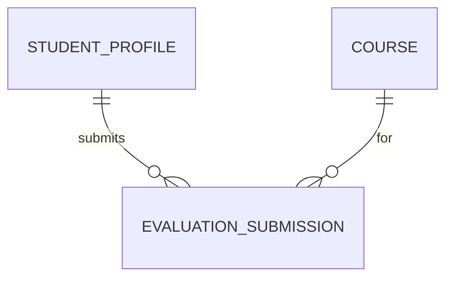

### Routes
| Method | Path | DTO In | DTO Out |
|--------|-----------------------|---------------|-------------------|
| GET | /evaluations | — | EvaluationSubmissionResponseDTO[] |
| POST | /evaluations | CreateEvaluationSubmissionDTO | EvaluationSubmissionResponseDTO |

### DTOs

**CreateEvaluationSubmissionDTO**
```ts
const CreateEvaluationSubmissionDTO = z.object({
  studentId: z.string().uuid(),
  courseCodeTitle: z.string(),
  instructor: z.string(),
  teachingQuality: z.number().int().min(1).max(5),
  courseMaterials: z.number().int().min(1).max(5),
  punctuality: z.number().int().min(1).max(5),
  comments: z.string().optional(),
})

const UpdateEvaluationSubmissionDTO = CreateEvaluationSubmissionDTO.partial()

const EvaluationSubmissionResponseDTO = z.object({
  id: z.string().uuid(),
  studentId: z.string().uuid(),
  courseCodeTitle: z.string(),
  instructor: z.string(),
  teachingQuality: z.number().int(),
  courseMaterials: z.number().int(),
  punctuality: z.number().int(),
  comments: z.string().optional(),
  submittedAt: z.string().datetime(),
})
```

## DocumentRequest

### Model
| Field | Type | Notes |
|-------------|-----------|--------------------|
| id | string | UUID, PK (inferred) |
| studentId | string | FK `StudentProfile.id` |
| type | string | `TOR` \| `GoodMoral` \| `COE` |
| purpose | string | |
| program | string? | nullable (Good Moral UI) |
| yearLevel | string? | nullable (Good Moral UI) |
| copies | number? | nullable (TOR UI) |
| deliveryMethod | string? | `Pickup` \| `Courier` |
| reference | string | server-generated |
| status | string | `PROCESSING` \| `ACCEPTED` \| `READY_FOR_PICKUP` |
| submittedAt | Date | server-set |
| updatedAt | Date | server-set |

### Mermaid JS
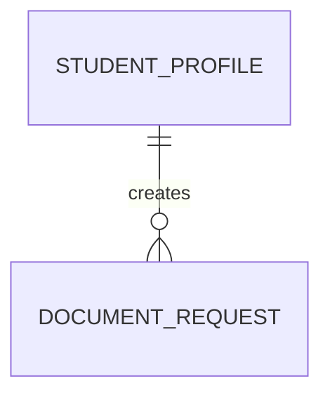

### Routes
| Method | Path | DTO In | DTO Out |
|--------|-----------------------|---------------|-------------------|
| GET | /document-requests | — | DocumentRequestResponseDTO[] |
| GET | /document-requests/:id | — | DocumentRequestResponseDTO |
| POST | /document-requests | CreateDocumentRequestDTO | DocumentRequestResponseDTO |

### DTOs

**CreateDocumentRequestDTO**
```ts
const CreateDocumentRequestDTO = z.object({
  studentId: z.string().uuid(),
  type: z.enum(["TOR", "GoodMoral", "COE"]),
  purpose: z.string(),
  program: z.string().optional(),
  yearLevel: z.string().optional(),
  copies: z.number().int().min(1).optional(),
  deliveryMethod: z.enum(["Pickup", "Courier"]).optional(),
})

const UpdateDocumentRequestDTO = CreateDocumentRequestDTO.partial()

const DocumentRequestResponseDTO = z.object({
  id: z.string().uuid(),
  studentId: z.string().uuid(),
  type: z.enum(["TOR", "GoodMoral", "COE"]),
  purpose: z.string(),
  program: z.string().optional(),
  yearLevel: z.string().optional(),
  copies: z.number().int().optional(),
  deliveryMethod: z.enum(["Pickup", "Courier"]).optional(),
  reference: z.string(),
  status: z.enum(["PROCESSING", "ACCEPTED", "READY_FOR_PICKUP"]),
  submittedAt: z.string().datetime(),
  updatedAt: z.string().datetime(),
})
```

## Complaint

### Model
| Field | Type | Notes |
|-------------|-----------|--------------------|
| id | string | UUID, PK (inferred) |
| studentId | string | FK `StudentProfile.id` |
| title | string | |
| status | string | `IN_REVIEW` \| `RESOLVED` |
| createdAt | Date | server-set |
| updatedAt | Date | server-set |

### Mermaid JS
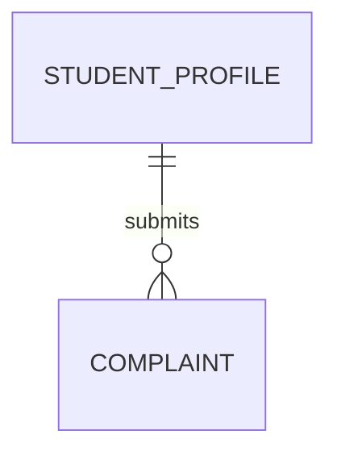

### Routes
| Method | Path | DTO In | DTO Out |
|--------|-----------------------|---------------|-------------------|
| GET | /complaints | — | ComplaintResponseDTO[] |
| POST | /complaints | CreateComplaintDTO | ComplaintResponseDTO |

### DTOs

**CreateComplaintDTO**
```ts
const CreateComplaintDTO = z.object({
  studentId: z.string().uuid(),
  title: z.string(),
})

const UpdateComplaintDTO = CreateComplaintDTO.partial()

const ComplaintResponseDTO = z.object({
  id: z.string().uuid(),
  studentId: z.string().uuid(),
  title: z.string(),
  status: z.enum(["IN_REVIEW", "RESOLVED"]),
  createdAt: z.string().datetime(),
  updatedAt: z.string().datetime(),
})
```

## GradeRecord

### Model
| Field | Type | Notes |
|-------------|-----------|--------------------|
| id | string | UUID, PK (inferred) |
| studentId | string | FK `StudentProfile.id` |
| title | string | |
| codeCredits | string | parseable to `{courseCode, credits}` // ? |
| gradePoint | string | parseable numeric // ? |
| status | string | `COMPLETED` \| `IN_PROGRESS` |
| semesterLabel | string? | nullable |
| createdAt | Date | server-set |

### Mermaid JS
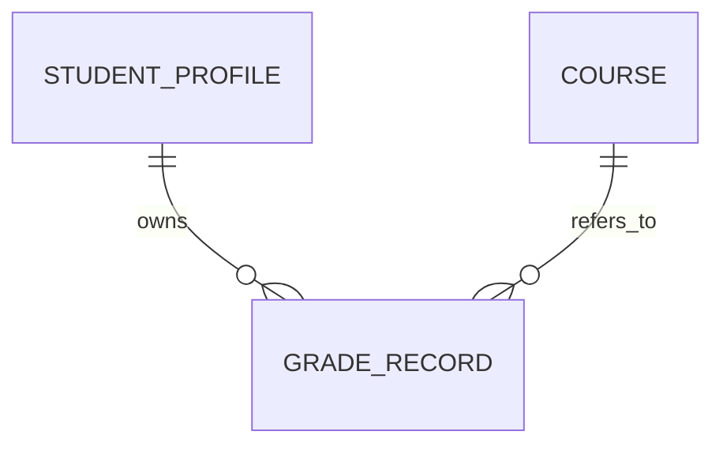

### Routes
| Method | Path | DTO In | DTO Out |
|--------|-----------------------|---------------|-------------------|
| GET | /grades | — | GradeRecordResponseDTO[] |

### DTOs

**CreateGradeRecordDTO**
```ts
const CreateGradeRecordDTO = z.object({
  studentId: z.string().uuid(),
  title: z.string(),
  codeCredits: z.string(),
  gradePoint: z.string(),
  status: z.enum(["COMPLETED", "IN_PROGRESS"]),
  semesterLabel: z.string().optional(),
})

const UpdateGradeRecordDTO = CreateGradeRecordDTO.partial()

const GradeRecordResponseDTO = z.object({
  id: z.string().uuid(),
  studentId: z.string().uuid(),
  title: z.string(),
  codeCredits: z.string(),
  gradePoint: z.string(),
  status: z.enum(["COMPLETED", "IN_PROGRESS"]),
  semesterLabel: z.string().optional(),
  createdAt: z.string().datetime(),
})
```

## Transaction

### Model
| Field | Type | Notes |
|-------------|-----------|--------------------|
| id | string | UUID, PK (inferred) |
| studentId | string | FK `StudentProfile.id` |
| title | string | |
| date | Date | source UI currently string |
| amount | string | currency-formatted string // ? |
| isPaid | boolean | |
| createdAt | Date | server-set |

### Mermaid JS
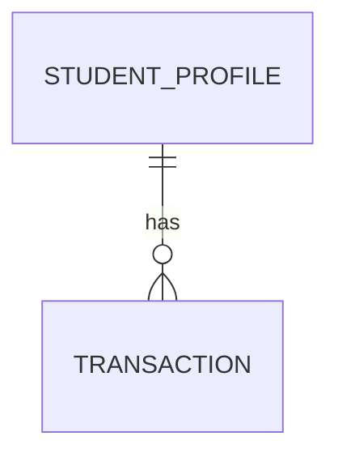

### Routes
| Method | Path | DTO In | DTO Out |
|--------|-----------------------|---------------|-------------------|
| GET | /transactions | — | TransactionResponseDTO[] |

### DTOs

**CreateTransactionDTO**
```ts
const CreateTransactionDTO = z.object({
  studentId: z.string().uuid(),
  title: z.string(),
  date: z.string().datetime(),
  amount: z.string(),
  isPaid: z.boolean(),
})

const UpdateTransactionDTO = CreateTransactionDTO.partial()

const TransactionResponseDTO = z.object({
  id: z.string().uuid(),
  studentId: z.string().uuid(),
  title: z.string(),
  date: z.string().datetime(),
  amount: z.string(),
  isPaid: z.boolean(),
  createdAt: z.string().datetime(),
})
```

## LibraryBook

### Model
| Field | Type | Notes |
|-------------|-----------|--------------------|
| id | string | UUID, PK |
| title | string | |
| author | string | |
| rating | number | |
| genre | string | |
| stockLabel | string | |
| stockStatus | string | `Available` \| `Limited` \| `OutOfStock` |
| isNew | boolean | |
| tab | string | `Available` \| `Return` \| `History` |
| createdAt | Date | server-set |

### Mermaid JS
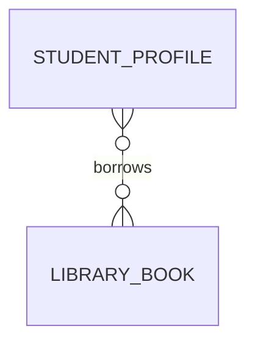

### Routes
| Method | Path | DTO In | DTO Out |
|--------|-----------------------|---------------|-------------------|
| GET | /library-books | — | LibraryBookResponseDTO[] |
| PUT | /library-books/:id | UpdateLibraryBookDTO | LibraryBookResponseDTO |

### DTOs

**CreateLibraryBookDTO**
```ts
const CreateLibraryBookDTO = z.object({
  title: z.string(),
  author: z.string(),
  rating: z.number(),
  genre: z.string(),
  stockLabel: z.string(),
  stockStatus: z.enum(["Available", "Limited", "OutOfStock"]),
  isNew: z.boolean().optional(),
  tab: z.enum(["Available", "Return", "History"]),
})

const UpdateLibraryBookDTO = CreateLibraryBookDTO.partial()

const LibraryBookResponseDTO = z.object({
  id: z.string().uuid(),
  title: z.string(),
  author: z.string(),
  rating: z.number(),
  genre: z.string(),
  stockLabel: z.string(),
  stockStatus: z.enum(["Available", "Limited", "OutOfStock"]),
  isNew: z.boolean(),
  tab: z.enum(["Available", "Return", "History"]),
  createdAt: z.string().datetime(),
})
```

## ScheduleEntry

### Model
| Field | Type | Notes |
|-------------|-----------|--------------------|
| id | string | UUID, PK (inferred) |
| studentId | string | FK `StudentProfile.id` |
| dayLabel | string | |
| courseCode | string | |
| courseTitle | string | |
| timeRange | string | |
| room | string | |
| instructor | string | |
| createdAt | Date | server-set |

### Mermaid JS
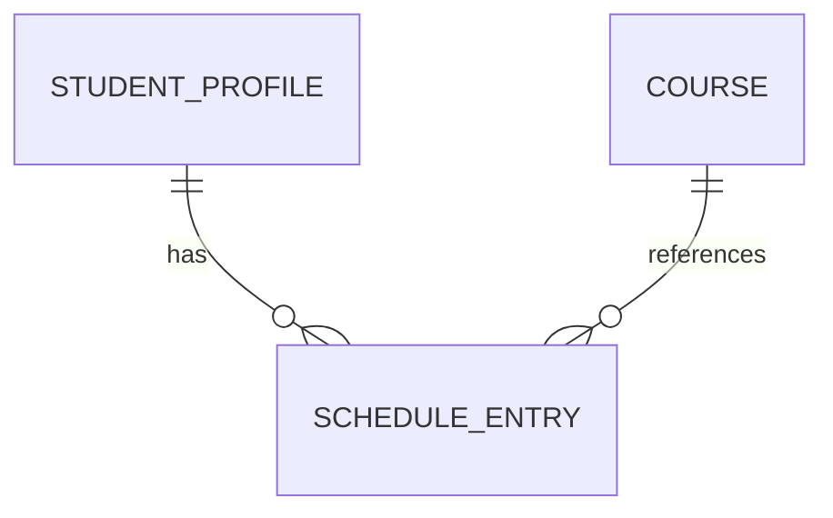

### Routes
| Method | Path | DTO In | DTO Out |
|--------|-----------------------|---------------|-------------------|
| GET | /schedule | — | ScheduleEntryResponseDTO[] |

### DTOs

**CreateScheduleEntryDTO**
```ts
const CreateScheduleEntryDTO = z.object({
  studentId: z.string().uuid(),
  dayLabel: z.string(),
  courseCode: z.string(),
  courseTitle: z.string(),
  timeRange: z.string(),
  room: z.string(),
  instructor: z.string(),
})

const UpdateScheduleEntryDTO = CreateScheduleEntryDTO.partial()

const ScheduleEntryResponseDTO = z.object({
  id: z.string().uuid(),
  studentId: z.string().uuid(),
  dayLabel: z.string(),
  courseCode: z.string(),
  courseTitle: z.string(),
  timeRange: z.string(),
  room: z.string(),
  instructor: z.string(),
  createdAt: z.string().datetime(),
})
```

## Auth Notes
- Login UI shows `studentId` + `password` + `keepLoggedIn`; minimal auth contract is `POST /auth/login` with access token and optional refresh token when keep-logged-in is true.

## Open Questions
- Enrollment UI stores both `studentId` and `studentIdNumber`, so backend should confirm whether these are distinct fields or aliases.
- `amount` and `gradePoint` are UI-formatted strings and should be normalized to numeric value + display format rules.
- Course relation to `Program` is implied by labels only and needs an explicit `programId` mapping source.
